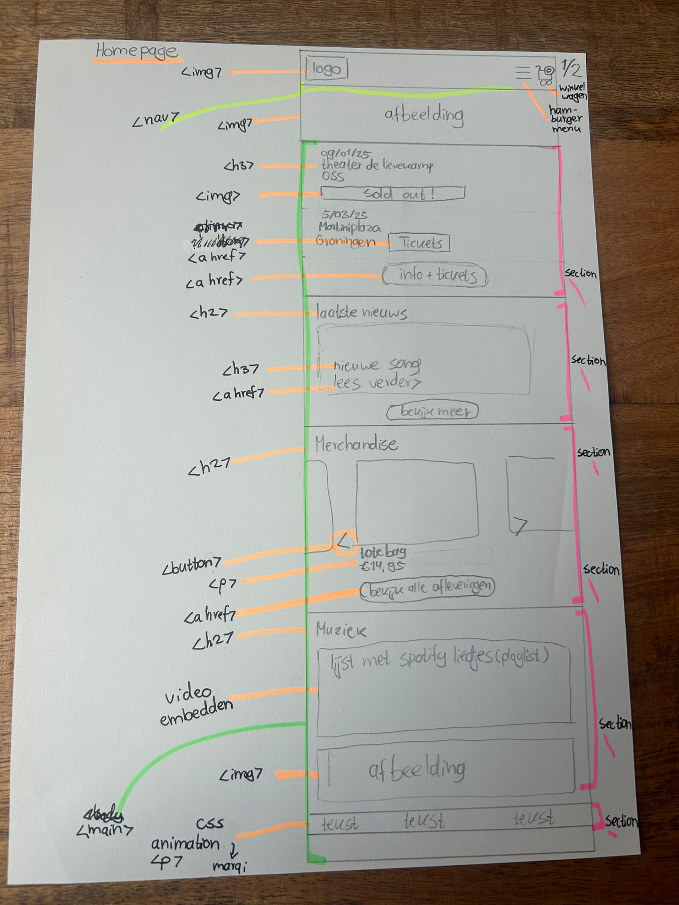
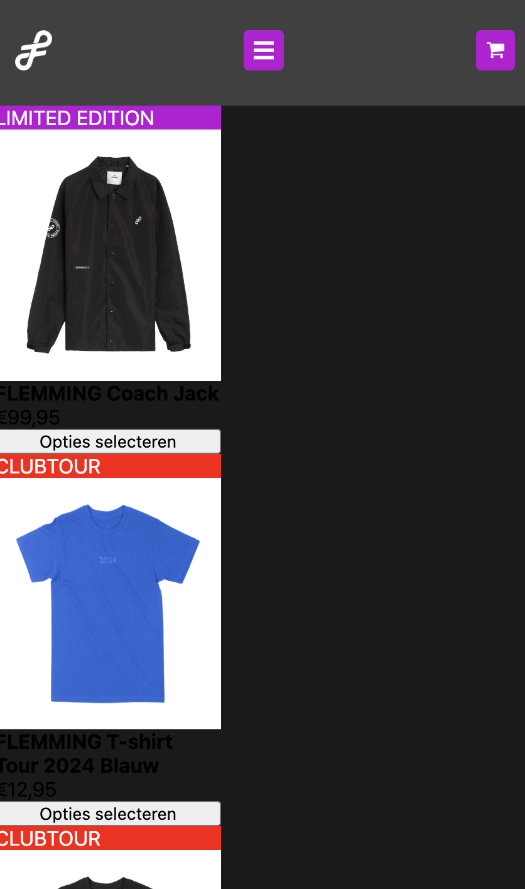

# Procesverslag
Markdown is een simpele manier om HTML te schrijven.  
Markdown cheat cheet: [Hulp bij het schrijven van Markdown](https://github.com/adam-p/markdown-here/wiki/Markdown-Cheatsheet).

Nb. De standaardstructuur en de spartaanse opmaak van de README.md zijn helemaal prima. Het gaat om de inhoud van je procesverslag. Besteedt de tijd voor pracht en praal aan je website.

Nb. Door *open* toe te voegen aan een *details* element kun je deze standaard open zetten. Fijn om dat steeds voor de relevante stuk(ken) te doen.

## Jij

  
uitwerken voor kick-off werkgroep

  ### Auteur:
  Alyssa Teunissen (vervangen door jouw naam)

  #### Je startniveau:
  blauw (kies uit zwart, rood óf blauw)

  #### Je focus:
  surface plane (kies uit responsive óf surface plane)
 

## Je website

  
uitwerken voor kick-off werkgroep

  ### Je opdracht:
  link naar de website die je gaat namaken óf de naam/omschrijving van je eigen ontwerp
  https://www.flemmingmusic.nl/

  #### Screenshot(s) van de eerste pagina (small screen): 
  homepage  
  

  #### Screenshot(s) van de tweede pagina (small screen):
  shop  
  
 

## Toegankelijkheidstest 1/2 (week 1)

  
uitwerken na test in 2e werkgroep

Voice over test: de website is over het algemeen toegankelijk met voice over, knoppen worden voorgelezen, links worden benoemd, alleen de tekst in afbeeldingen word niet voorgelezen en de alt tekst van producten kan uitgebreider.

  ### Bevindingen
  Lijst met je bevindingen die in de test naar voren kwamen:
  pluspunten:
  -duidelijke taal
  -links zijn toegankelijk
  -scrollen gaat goed
  -video's zijn toegankelijk
  -links zien eruit als links, alleen een paar zijn niet duidelijk
   
   minpunten:
   -122 waarschuwingen
   -4 errors
   -sommige knoppen te klein
   -geen list elements
   -alt tektst beschrijft afbeelding niet goed
   -labels van plaatjes missen, staan in een div
   -maakt geen gebruik van darkmode
   -Grote gele tekst oogt raar met hoog contrast

   WCAG checklist:
   
   
   
   
   

## Breakdownschets (week 1)

  
uitwerken na afloop 3e werkgroep

  ### de hele pagina: 
  
  
  

  ### dynamisch deel (bijv menu): 
  

  ### wellicht nog een dynamisch deel (bijv filter): 
  

## Voortgang 1 (week 2)

  
uitwerken voor 1e voortgang

  ### Stand van zaken
  Flexbox ging me best goed af, Javascript ging oke, alleen de grid vond ik best lastig. (neem ook screenshots op van delen van je website en code)

  ### Agenda voor meeting
  samen met je groepje opstellen

  | Andrea           | Penelope           | Louiza       | Alyssa        |
  | ---              | ---                | ---          | ---           |
  | Font inladen,    | ?                  | ?            | banner met    |
  |waar zijn fonts   |                    |              |bewegende tekst|
  |te vinden?        |                    |              |               |
  

  ### Verslag van meeting
  hier na afloop snel de uitkomsten van de meeting vastleggen

  Feedback: 
  -witregels in code toepassen
  -alt tekst aanpassen
  -toegankelijkheid verwerken

  Tips:
  -misschien van social media logo's svg's maken. 

## Voortgang 2 (week 3)

  
uitwerken voor 2e voortgang

  ### Stand van zaken
  Grid vind ik nog steeds erg lastig.
  Als ik de video bekijk, snap ik hoe het werkt, maar zodra ik moet coderen weet ik niet goed waar ik moet beginnen (waar ik de code in mijn Css neer moet zetten). (neem ook screenshots op van delen van je website en code)

  ### Agenda voor meeting
  samen met je groepje opstellen

  | Andrea           | Penelope           | Louiza       | Alyssa        |
  | ---              | ---                | ---          | ---           
  |                  | ?                  |carousel maken|  fonts inladen, hoe button en link vormgeven,
  |                  |                    |              |  wat zijn eisen voor toegankelijkheid, hoe pas ik grid toe,
  |                  |                    |              |  moet hamburgermenu responsive zijn?
  |                  |                    |              |
  |                  |                    |              |               
  

  ### Verslag van meeting
  hier na afloop snel de uitkomsten van de meeting vastleggen

  - font inladen via Googlefonts
  - link die eruit ziet als button wel <a> tag geven, maar met padding stylen
  - alt tekts, geen tekst in afbeeldingen, links weergeven als links (<a>) (zie https://www.a11yproject.com/checklist/ voor basis toegankelijkheid)

## Toegankelijkheidstest 2/2 (week 4)

  
uitwerken na test in 9e werkgroep

  ### Bevindingen
  Lijst met je bevindingen die in de test naar voren kwamen (geef ook aan wat er verbeterd is):
 Positieve uitkomst:
 -alt tektsen bij afbeeldingen werden voorgelezen
 -tekst op buttons werd voorgelezen
 -het was mogelijk om overal doorheen te gaan met tab

 Alle elementen op de website konden door de screenreader gevonden en voorgelezen worden.

## Voortgang 3 (week 4)

  
uitwerken voor 3e voortgang

  ### Stand van zaken
  Het gaat de goede kant op, er moeten nog wat elementen ingevoegd worden, maar de website krijgt steeds meer vorm en begint steeds meer te lijken op de originele. (neem ook screenshots op van delen van je website en code)

  ### Agenda voor meeting
  samen met je groepje opstellen

  | Andrea           | Penelope           | Louiza       | Alyssa        |
  | ---              | ---                | ---          | ---           |
  |                  | ?                  |carousel maken| hoe padding verwijderen menu buttons, erros weghalen.
  |                  |                    |              |  
  |                  |                    |              |  
  |                  |                    |              |
  |                  |                    |              |               

  ### Verslag van meeting
  hier na afloop snel de uitkomsten van de meeting vastleggen

  - om 'padding' te verwijderen achtergrond kleur aanpassen
  - Css elementen weghalen uit HTML, errors over iframes en translate negeren

Feedback:
-buttons die links zijn, <a> tag geven
-nieuws artikelen <section> en <article> tag geven
-footer <ul> met <li> (toevoegen)
-custom properties toepassen
-pixels weghalen
-timetag toepassen 

## Eindgesprek (week 5)

  
uitwerken voor eindgesprek

  ### Je uitkomst - karakteristiek screenshots:
  Ik had wat problemen met Fireshot waardoor het niet lukte om screenshots te maken van de pagina's.

  ### Dit ging goed/Heb ik geleerd: 
  Korte omschrijving met plaatjes

  Ik heb geleerd hoe ik een carousel met bewegende tekst kan maken, hoe ik video's kan embedden, links in afbeeldingen kan embedden, een hamburger menu maak en verschillende versies van een font in kan laden. Flexbox ging me goed af.
 
  
   
    
    
  

  ### Dit was lastig/Is niet gelukt:
  Korte omschrijving met plaatjes

  Ondanks dat ik bij het laatste feedback gesprek in de veronderstelling was dat het me zou lukken om de website tijdig af te krijgen, is het me niet gelukt. Er waren heel veel elementen op mijn website die allemaal een andere opmaak nodig hadden en daardoor heb ik ontelbare classes aan gemaakt wat waarschijnlijk niet de meest efficiënte manier is. Daarnaast hadden veel verschillende elementen ook allemaal andere padding en ik wilde niet nog meer classes aan maken, vandaar dat de padding op sommige plekken niet toegepast is. Ik wist namelijk niet hoe ik het anders kon oplossen. Hetzelfde geld voor sommige kopjes die een andere kleur hebben. Ik had ook geprobeerd om een grid toe te passen bij de shop pagina, maar het lukt me nog steeds niet om een grid te maken, ik vind het erg lastig en ik weet niet goed waar ik moet beginnen met maken ervan. Ook had ik geen tijd meer om een carousel te maken met een preview van de shop. Kort samen gevat, ik heb heel erg mijn best gedaan, maar ik liep op het laatste moment heel erg vast en ik heb extra hulp nodig om mijn website af te kunnen maken.
  
  
  

  ### Poging 2 (herkansing) recap:
  De vorige keer had ik mijn werk ingeleverd ondanks dat het niet af was. 
  Tijdens het gesprek heb ik meer inzicht gekregen hoe ik de problemen waar ik tegen aan liep, op kon lossen en had ik het gevoel dat ik met deze nieuwe kennis mijn website af kon maken. 
  Ik heb mensen om hulp gevraagd, ik heb tutorials gekeken op Youtube, lesopdrachten opnieuw gemaakt en ik ben naar een vragen uurtje geweest om verder te komen met mijn website.
  Ik heb in plaats van classes gekeken naar andere oplossingen zoals first-of-type, id’s etc. waardoor ik geen extra classes hoefde aan te maken om elementen te stylen. Hetzelfde geldt voor de padding die eerst op sommige plekken ontbrak. Bovendien is het me ook gelukt om de carousel toe te voegen aan mijn homepage. Al met al is het gelukt om mijn website af te maken en heb ik mijn best gedaan om de website zoveel mogelijk op de officiele te laten lijken. 
  
  
  
  
  

## Bronnenlijst

  
continu bijhouden terwijl je werkt

  Nb. Wees specifiek ('css-tricks' als bron is bijv. niet specifiek genoeg). 
  Nb. ChatGpT en andere AI horen er ook bij.
  Nb. Vermeld de bronnen ook in je code.

  1. Bron: Link in afbeelding embedden, Adonnah, 
  2. Bron: Logo carousel with CSS, https://www.youtube.com/watch?v=nAjR0Oj0J8E&t=325s&ab_channel=CodingwithRobby 
  3. Bron: Video embedden, Google help, https://support.google.com/youtube/answer/171780?hl=en#:~:text=Embed%20a%20video%20or%20playlist&text=From%20the%20list%20of%20Share,com%20to%20the%20firewall%20allowlist
  4. Bron: Playlist embedden, Spotify for developers, https://developer.spotify.com/documentation/embeds/tutorials/creating-an-embed
  5. Bron: Time tag, Mdn web docs, https://developer.mozilla.org/en-US/docs/Web/HTML/Element/time 
  6. Bron: Tekst in afbeelding plaatsen, https://www.youtube.com/watch?v=Si4ViAvvnwU&ab_channel=DcodeShow
  7. Bron: Audio koppelen aan button, https://www.youtube.com/watch?v=6ukTdMSlerI&ab_channel=PastorCanayo 
  8. Bron: Light/darkmode, Luna Jay, 
  9. Bron: Img positioneren, W3 schools, https://www.w3schools.com/howto/howto_css_image_center.asp
 10. Bron: Last of type, Luna Jay 
  

